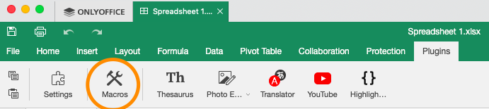
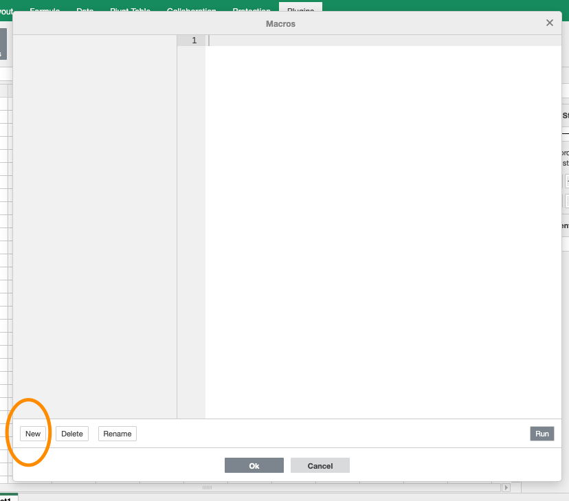

# onlyoffice-macros
Macros for OnlyOffice [OnlyOfficeSpreadsheetMacroAPI](https://api.onlyoffice.com/docbuilder/spreadsheetapi)

To use this macros go to the plugins.




```javascript
(function()
{
    var activeSheet = Api.GetActiveSheet();
    var usedRange = activeSheet.GetUsedRange();
    var firstRow = usedRange.GetRows(1); 
    // Remove New Lines from Titles
    firstRow.ForEach(function(cell){
        var value = cell.GetValue();
        var newValue = value.split("\n").join(" ");
        cell.SetValue(newValue);
    });
})();
```


